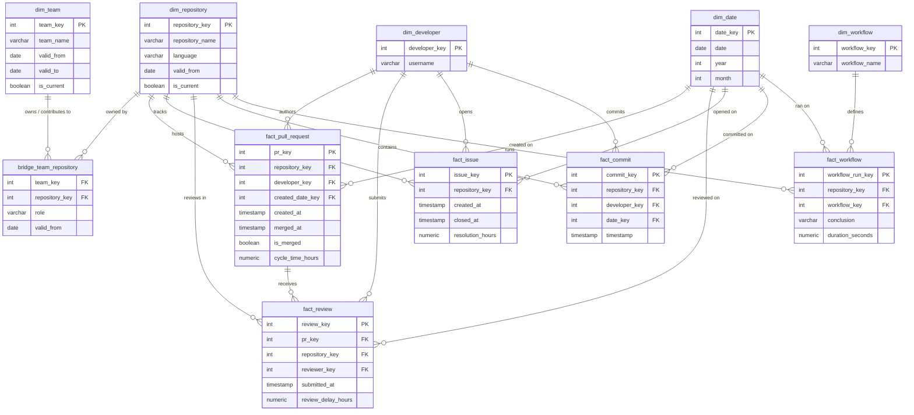

# Entity Relationship Diagram

This diagram visualizes the Star Schema designed for EngineeringPulse, highlighting the relationship between Fact, Dimension, and Bridge tables.

```mermaid
erDiagram
    %% Dimensions
    dim_date {
        int date_key PK
        date date
        int year
        int month
    }
    
    dim_team {
        int team_key PK
        varchar team_name
        date valid_from
        date valid_to
        boolean is_current
    }
    
    dim_repository {
        int repository_key PK
        varchar repository_name
        varchar language
        date valid_from
        boolean is_current
    }
    
    dim_developer {
        int developer_key PK
        varchar username
    }
    
    dim_workflow {
        int workflow_key PK
        varchar workflow_name
    }

    %% Bridge Table
    bridge_team_repository {
        int team_key FK
        int repository_key FK
        varchar role
        date valid_from
    }

    %% Facts
    fact_pull_request {
        int pr_key PK
        int repository_key FK
        int developer_key FK
        int created_date_key FK
        timestamp created_at
        timestamp merged_at
        boolean is_merged
        numeric cycle_time_hours
    }

    fact_review {
        int review_key PK
        int pr_key FK
        int repository_key FK
        int reviewer_key FK
        timestamp submitted_at
        numeric review_delay_hours
    }
    
    fact_issue {
        int issue_key PK
        int repository_key FK
        timestamp created_at
        timestamp closed_at
        numeric resolution_hours
    }
    
    fact_commit {
        int commit_key PK
        int repository_key FK
        int developer_key FK
        int date_key FK
        timestamp timestamp
    }

    fact_workflow {
        int workflow_run_key PK
        int repository_key FK
        int workflow_key FK
        varchar conclusion
        numeric duration_seconds
    }

    %% Relationships
    dim_team ||--o{ bridge_team_repository : "owns / contributes to"
    dim_repository ||--o{ bridge_team_repository : "owned by"
    
    dim_repository ||--o{ fact_pull_request : "hosts"
    dim_developer ||--o{ fact_pull_request : "authors"
    dim_date ||--o{ fact_pull_request : "created on"
    
    fact_pull_request ||--o{ fact_review : "receives"
    dim_developer ||--o{ fact_review : "submits"
    
    dim_repository ||--o{ fact_issue : "tracks"
    dim_date ||--o{ fact_review : "reviewed on"
    dim_date ||--o{ fact_issue : "opened on"
    dim_date ||--o{ fact_commit : "committed on"
    dim_date ||--o{ fact_workflow : "ran on"

    dim_repository ||--o{ fact_review : "reviews in"
    dim_repository ||--o{ fact_commit : "contains"
    dim_developer ||--o{ fact_issue : "opens"
    dim_developer ||--o{ fact_commit : "commits"
    dim_repository ||--o{ fact_workflow : "runs"
    dim_workflow ||--o{ fact_workflow : "defines"
```
